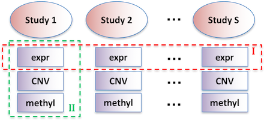
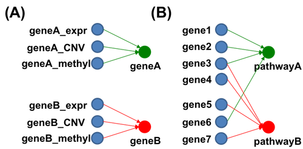

```{r setup, include = FALSE}
knitr::opts_chunk$set(
  collapse = TRUE,
  comment = "#>"
)
```


## Introduction

**MISKmeans** is short for meta-analytic integrative sparse Kmeans, which aims to integrate multiple omics data, multiple cohort data and incorporate prior biological knowledge to perform feature selection and sample clustering (discovery disease subtypes).
MISKmeans R package can be found on GitHub page <https://github.com/Caleb-Huo/MIS-Kmeans>.
Figure 1 below shows the layout for such two-way integration.




The input should be multiple cohorts, with each cohort containing one or more omics profiles (e.g. gene expression, CNV, methylation...).
The features (genes) from one or more omics profiles are group by prior biological knowledge.
Usually the prior biological knowledge could be the cis regulatory relationship between mRNA, methylation and CNV of the same gene symbol;
or a biological pathway including a collection of functional genes which can potentially overlap with other pathways.
An illustration of such group in is shown in Figure 2. 
Figure 2(A): A group contains gene expression, CNV and methylation of the same gene symbol.
Figure 2(B): A group is a pathway, which is a collection of genes (e.g. cell cycle pathway).}





The MISKmeans algorithm is an extension from previous works meta sparse Kmeans (metaSparseKmeans) <https://github.com/Caleb-Huo/MetaSparseKmeans> and integrative sparse Kmeans (ISKmeans) <https://github.com/Caleb-Huo/IS-Kmeans>.
The MetaSparseKmeans is about combining multiple cohorts of the same omics data type (e.g. gene expression data from multiple cohorts as shown in the red dashed rectangles I in the figure above) and perform a joint feature selection and sample clustering.
The ISKmeans is about integrating multiple levels of omics data (e.g. multiple levels of omics data of the same patient cohort as shown in the green dashed rectangles II in the figure above).
The MISKmeans is a combination of MetaSparseKmeans and ISKmeans, which is among the first to acheive two-way omics data integration.


In the next section, we will provide a concrete example how to use MISKmeans package.
The step by step procedure will guide the users how to prepare the data and how to use the package.

## Usage of MISKmeans package

### Outline

We will use the multi omics profile of TCGA breast cancer data as an illustrating example to show how to utilize this MISKmeans package.
The following steps are included.

1. What is the input data format.
2. An example on the integration of gene expression data + CNV data.
3. An example on the integration of gene expression data + methylation data.
4. An example on the integration of gene expression data + CNV + methylation data.


### Input data format

The input data should be multiple levels of omics data, as the format of data matrix, with common sample names for each layer of omics data.
In this vignette, we will integrate gene expression, CNV and methylation of TCGA breast cancer dataset.
A simplified version of these omics profiles can be accessed by data(BRCA_Expr2), dim(BRCA_CNV2) and dim(BRCA_Meth2).

```{r}
library(MISKmeans)
data("BRCA_Expr2") ## gene expression profile
data("BRCA_CNV2") ## copy number variation profile
data("BRCA_Meth2") ## DNA methylation profile

dim(BRCA_Expr2)
dim(BRCA_CNV2)
dim(BRCA_Meth2)
```

There are totally 770 common subjects for each layer of omics data.
The following code is to check the sample names are all the same.

```{r}
## check the sample names
all(colnames(BRCA_Expr2) == colnames(BRCA_CNV2))
all(colnames(BRCA_Expr2) == colnames(BRCA_Meth2))
```

Since MISKmeans is able to integrate multiple cohorts,
we split the 770 subjects into two sub studies.

```{r}
index_sub1 <- 1:385
index_sub2 <- 386:770
```

Finally, prepare the multi-cohort and multi-omics studies.
```{r}
study1_Expr <- BRCA_Expr2[,index_sub1] ## study 1, gene expression
study1_CNV <- BRCA_CNV2[,index_sub1] ## study 1, CNV
study1_Meth <- BRCA_Meth2[,index_sub1] ## study 1, methylation

study2_Expr <- BRCA_Expr2[,index_sub1] ## study 2, gene expression
study2_CNV <- BRCA_CNV2[,index_sub1] ## study 2, CNV
study2_Meth <- BRCA_Meth2[,index_sub1] ## study 2, methylation
```

### An example on the integration of gene expression data + CNV data.

We first need to combine the profiles of Expr and CNV.
```{r}
study1_combineEC <- rbind(study1_Expr, study1_CNV)
study2_combineEC <- rbind(study2_Expr, study2_CNV)
data_combineEC <- list(t(study1_combineEC), t(study2_combineEC))
```

Second we need to prepare the grouping information between Expr and CNV.
The grouping information should be input as a list:
```{r}
omicsTyps <- c(rep('gene',nrow(study1_Expr)),rep('CNV',nrow(study1_CNV)))
featureNames <- c(rownames(study1_Expr),rownames(study1_CNV))
groups <- split(1:length(featureNames),featureNames)
```

Third step is to perform MISKmeans
```{r}
#res_combineEC <- MISKmeans(data_combineEC,K=5,group=groups,gamma=0.5)
#table(res_combineEC$ws != 0)
#res_combineEC$Cs
```

visualization for the gene expression profile and CNV profile


